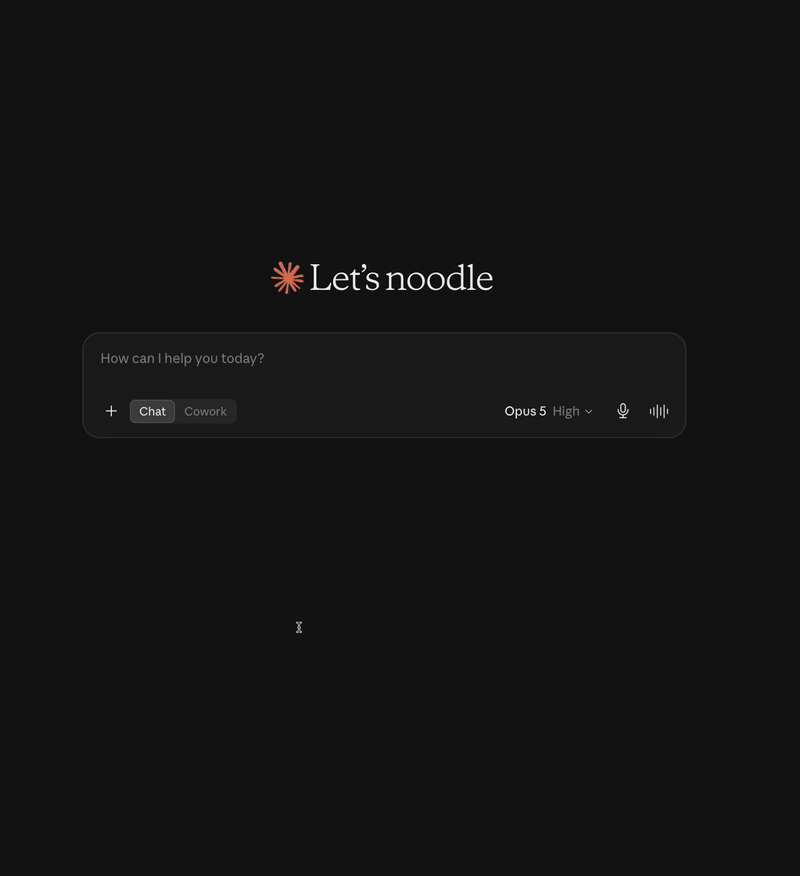
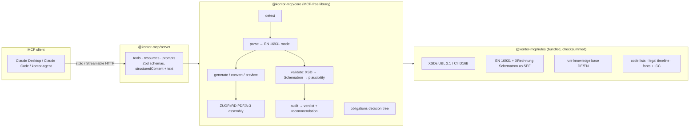

# Kontor MCP

> **The sovereign e-invoice toolkit for AI agents.** Official XRechnung / EN 16931 validation, ZUGFeRD in *and* out, 100 % offline, zero API keys.

[](https://github.com/DashankaNadeeshanDeSilva/kontor-mcp/actions/workflows/ci.yml)
[](docs/CONFORMANCE.md)
[](docs/CONFORMANCE.md#generated-zugferd-pdfa-3-task-27)
[](LICENSE)
[](https://www.npmjs.com/package/@kontor-mcp/server) [](https://registry.modelcontextprotocol.io/v0.1/servers?search=io.github.DashankaNadeeshanDeSilva/kontor-mcp) [](https://dashankanadeeshandesilva.github.io/kontor-mcp/)

Kontor MCP is a local, offline toolbox that lets AI assistants (Claude Desktop, Claude Code, any [MCP](https://modelcontextprotocol.io) client) handle German/EU e-invoices: XRechnung and ZUGFeRD/Factur-X under EN 16931. It can **read** an invoice (bare XML or XML embedded in a PDF), **check** it against the official KoSIT / EN 16931 rulebooks, **explain** cryptic errors in German or English, **create** valid new invoices (XML or ZUGFeRD PDF/A-3), **convert** between formats, and **tell a business which legal obligations apply**. The key promise is sovereignty: no cloud, no API keys, no network calls, no Java at runtime — proven by tests.

Why it matters: since 2025 every German business must be able to *receive* e-invoices, and from 2027/2028 must *issue* them. An e-invoice is validated XML, not a PDF, and a failed rule can cost the input-VAT deduction. Invoices carry personal and bank data, so they should be checked where they live — on your machine — with the same rule sets the public-sector receivers use.

**v1.0** — 8 tools · 4 resource families · 3 prompts · KoSIT conformance 89/89 enforced as a CI gate · ZUGFeRD PDF/A-3 output verified by veraPDF and Mustang · stdio and Streamable HTTP (bearer auth) · Docker image (amd64/arm64) · `kontor-agent` reference client · listed in the [Official MCP Registry](https://registry.modelcontextprotocol.io/v0.1/servers?search=io.github.DashankaNadeeshanDeSilva/kontor-mcp). Install with `npx`, Docker, or from source.



*Claude Desktop with the `kontor` server: validate → BR-DE-15 (missing Leitweg-ID) with fix hint · parse a ZUGFeRD PDF · explain BR-DE-18. [MP4](docs/media/v0.1-desktop-demo.mp4)*

## Why

- **Official rules, not approximations.** The KoSIT XRechnung Schematron and the CEN EN 16931 rules run unmodified (compiled to XSLT/SEF, executed with Saxon-JS) with the KoSIT scenario model — the same verdicts the public-sector receivers produce, [proven file-by-file](docs/CONFORMANCE.md) against the official validator.
- **Sovereign by construction.** Pure TypeScript/WASM, no Java at runtime, no network calls, nothing stored, nothing logged. Runs where the invoices are.
- **Agent-native.** Every tool returns structured content *and* a readable summary; findings carry DE/EN explanations, affected business terms and fix hints; generation is fail-honest (`valid` is the real verdict, never assumed).
- **ZUGFeRD both ways.** Read the embedded XML out of any ZUGFeRD/Factur-X PDF; write PDF/A-3 invoices with `factur-x.xml` that pass veraPDF and Mustang.

## Five-minute quickstart

Requires Node ≥ 20. Everything — rules, schemas, code lists, fonts — ships inside the npm package; no downloads at runtime, no Java.

| Install path | Command |
|---|---|
| **npx** (zero-config stdio) | `npx -y @kontor-mcp/server` |
| **Docker** (Streamable HTTP, token required) | `docker run -d -p 127.0.0.1:3333:3333 -e KONTOR_AUTH_TOKEN=… ghcr.io/dashankanadeeshandesilva/kontor-mcp` |
| **Reference client** | `npx -y -p @kontor-mcp/client kontor-agent audit invoice.xml` |
| **From source** | `git clone … && pnpm install && pnpm build` → `node packages/server/dist/bin.js` |

**Claude Desktop** — Settings → Developer → Edit Config, then quit (⌘Q) and reopen:

```json
{
  "mcpServers": {
    "kontor": {
      "command": "npx",
      "args": ["-y", "@kontor-mcp/server"]
    }
  }
}
```

(From a source checkout use `"command": "node", "args": ["/absolute/path/to/kontor-mcp/packages/server/dist/bin.js"]` instead.)
```

**Claude Code:**

```sh
claude mcp add kontor -- npx -y @kontor-mcp/server
```

**Now audit a sample invoice.** Ask Claude:

> Audit `/absolute/path/to/kontor-mcp/packages/server/samples/broken-missing-buyer-reference.xml` — is it valid?

You get a verdict (`invalid`), the finding **BR-DE-15** (missing buyer reference / Leitweg-ID) with an explanation and fix hint, the recomputed totals and VAT breakdown, and a *reject* recommendation with its rationale. Then try a ZUGFeRD PDF:

> What is in `/absolute/path/to/kontor-mcp/packages/server/samples/generated-zugferd-en16931.pdf`?

(Attach XML files directly if you prefer; PDFs must be referenced by local path — Claude Desktop does not hand PDF bytes to MCP servers.)

Without a chat client, the MCP Inspector works headless:

```sh
npx @modelcontextprotocol/inspector@latest --cli node packages/server/dist/bin.js \
  --method tools/call --tool-name audit_invoice \
  --tool-arg file_path=$PWD/packages/server/samples/broken-missing-buyer-reference.xml --tool-arg lang=en
```

**`kontor-agent` CLI** — the reference client; `audit` needs no LLM and returns 0/1/2 for accept/review/reject, `chat` is an Anthropic agent loop that prints every tool call (needs `ANTHROPIC_API_KEY`):

```sh
node packages/client/dist/bin.js audit packages/server/samples/broken-missing-buyer-reference.xml --lang en
node packages/client/dist/bin.js chat -m "Prüfe $PWD/packages/server/samples/valid-zugferd-en16931.pdf"
node packages/client/dist/bin.js --url http://127.0.0.1:3333/mcp --token "$KONTOR_AUTH_TOKEN" tools   # against Docker / HTTP
```

**Docker / Streamable HTTP** — the same server over HTTP for remote agents and containers (token required, loopback-published port, TLS is your reverse proxy's job):

```sh
docker build -t kontor-mcp .              # multi-stage, non-root, ~70 MB, amd64 + arm64
docker run -d -p 127.0.0.1:3333:3333 -e KONTOR_AUTH_TOKEN="$(openssl rand -hex 24)" kontor-mcp
curl -s http://127.0.0.1:3333/healthz     # {"ok":true,"name":"kontor-mcp",...}
```

Or `cp .env.example .env && docker compose up -d` (read-only root FS, `./invoices` mounted at `/data`). Config surface and the security posture: [`packages/server/README.md`](packages/server/README.md#streamable-http), [`SECURITY.md`](SECURITY.md).

## Tools

| Tool | What it does |
|---|---|
| `parse_invoice` | Detect the format (UBL / CII · EN 16931 · XRechnung version & variant · ZUGFeRD profile) and return the EN 16931 semantic model |
| `validate_invoice` | XSD + official EN 16931 / XRechnung Schematron (KoSIT scenarios) + Kontor plausibility → `valid` / `valid_with_warnings` / `invalid` with explained findings |
| `audit_invoice` | One call for accounts payable: header facts, VAT breakdown, verdict, grouped findings, **accept / review / reject** with rationale; stateless duplicate detection via `known_invoice_numbers` |
| `generate_invoice` | Structured data → **XRechnung 3.0 (UBL)** or **ZUGFeRD 2.3 / Factur-X PDF/A-3** (`target: zugferd-pdf`, profiles EN16931 / BASIC / EXTENDED); decimal-safe amounts, internal validation, deterministic auto-fixes reported |
| `convert_invoice` | ZUGFeRD PDF → XML, UBL ↔ CII via the semantic model (post-validated, honest loss report), self-contained HTML preview |
| `check_obligations` | German e-invoicing mandate decision tree (B2B/B2G/B2C, 2025 → 2028 transition, exemptions) with primary legal sources |
| `explain_rule` | Official text, explanation, affected business terms and fix hint for any `BR-*` / `BR-DE-*` / `KONTOR-*` rule id |
| `list_capabilities` | Formats, bundled standard versions, KB stats, legal `lastVerified`, inventory, sovereignty statement |

Resources: `kontor://samples/{name}`, `kontor://reference/rules`, `kontor://reference/codelists/{list}`, `kontor://reference/cheatsheet`. Prompts: `audit-incoming-invoice`, `draft-supplier-rejection`, `create-invoice-interview`. Full reference with inputs and conventions: [`packages/server/README.md`](packages/server/README.md).

## Sovereignty — and how we prove it

| Claim | Proof |
|---|---|
| No network at runtime | Every rule set, schema, code list and legal fact is bundled in `@kontor-mcp/rules` with [provenance and checksums](packages/rules/PROVENANCE.md). Proven by [`sovereignty.test.ts`](packages/core/test/sovereignty.test.ts): all outbound paths (sockets, DNS, TLS, http/https, `fetch`) are blocked and recorded while every tool, resource and prompt runs — zero attempts; a static scan allows a network import only in the inbound HTTP host; CI also runs a full audit in a `--network none` container. See [SECURITY.md](SECURITY.md#how-we-prove-it). |
| No Java, no native code | Schematron is compiled at build time and executed with Saxon-JS; XSD via `xmllint-wasm`; PDF via `pdf-lib`. Java is used only by the development-time oracles (KoSIT validator, veraPDF, Mustang) in CI. |
| Nothing stored, nothing logged | The server is stateless; invoice contents never reach a log (`KONTOR_LOG_PAYLOADS` defaults to off). |
| The verdicts are the official ones | [`docs/CONFORMANCE.md`](docs/CONFORMANCE.md): 89/89 files of the official XRechnung test suite with identical verdicts *and* identical findings vs the KoSIT validator, replayed on every CI run. |
| The PDFs are real PDF/A-3 | Every generated sample is regenerated in CI and checked by veraPDF (PDF/A-3b, zero violations) and Mustang CLI (PDF/A + XMP + profile XSD + EN 16931 rules). |

## Architecture



The validation pipeline: **Layer 1** XSD (`xmllint-wasm`) → **Layer 2** official Schematron (Saxon-JS, KoSIT scenario selection and severity overrides) → **Layer 3** Kontor plausibility (`KONTOR-PLAUS-*`: decimal recomputation, VAT rates, IBAN/BIC, Leitweg-ID check digits, dates, duplicates — never changes the official verdict). Money math is `decimal.js` only; every XML parse has DTD/external entities disabled.

## Conformance

| What | Reference | Result (2026-08-25) |
|---|---|---|
| Validation verdicts and findings | KoSIT validator 1.6.3, XRechnung 3.0.2 test suite (86 files) + Kontor fixtures (3) | **89/89** verdict *and* finding parity |
| Generated ZUGFeRD PDFs | veraPDF 1.30.2 (PDF/A-3b) | **6/6 PASS**, zero violations |
| Generated ZUGFeRD PDFs | Mustang CLI 2.26.0 (PDF/A + XMP + Factur-X profile XSD + EN 16931) | **6/6 valid** (EN 16931, BASIC, EXTENDED × DE/EN) |
| Generated XRechnung | own pipeline (identical to the oracle above), 50 random inputs | 50/50 valid and plausible |

Details, commands and recorded reports: [`docs/CONFORMANCE.md`](docs/CONFORMANCE.md).

## Packages

| Package | Purpose |
|---|---|
| [`@kontor-mcp/core`](packages/core) | MCP-free library: detect, parse, validate, audit, generate, convert, ZUGFeRD PDF |
| [`@kontor-mcp/rules`](packages/rules) | Bundled standards artefacts (XSDs, compiled Schematron, code lists, legal timeline, PDF assets) + rule knowledge base |
| [`@kontor-mcp/server`](packages/server) | MCP server (stdio and Streamable HTTP with bearer auth; Docker image) exposing tools, resources, prompts |
| [`@kontor-mcp/client`](packages/client) | `kontor-agent` — reference MCP client CLI: `tools` introspection, scriptable `audit <file>` (no LLM, exit codes), `chat` Anthropic agent loop with tool-call trace; stdio or HTTP |

## FAQ

**Is this legal or tax advice?** No. Kontor reports formal and technical checks against the published standards and the legal timeline with its sources; decisions remain yours. Every answer carries that disclaimer.

**Does it support XRechnung 3.0.2 / the 2025 rules?** Yes: XRechnung 3.0.2, Schematron 2.5.0, validator configuration 2026-01-31, EN 16931 1.3.16. Versions are pinned and listed by `list_capabilities`.

**Which ZUGFeRD profiles can it read and write?** Read: MINIMUM, BASIC WL, BASIC, EN 16931, EXTENDED, XRECHNUNG (profile from the XMP). Write: EN 16931 (default), BASIC, EXTENDED — see [D-042](docs/DECISIONS.md) for what BASIC drops.

**Can I send it a PDF from Claude Desktop?** Reference it by local path. Desktop does not pass attached PDF bytes to MCP servers; XML attachments work either way.

**Why no Java when KoSIT's validator is Java?** Sovereignty and installability: Schematron is compiled once at build time and executed in TypeScript (Saxon-JS). The Java tools are used only as oracles in CI to prove parity.

**Windows?** Yes — CI runs the full test suite on Ubuntu, macOS and Windows with Node 20 and 22.

## Development

```sh
pnpm install
pnpm build
pnpm -r test
pnpm lint
pnpm artifacts        # fetch pinned third-party artefacts for the oracles (dev only)
pnpm oracle --diff …  # KoSIT parity (Java 17+)
pnpm check:zugferd    # regenerate samples, veraPDF + Mustang (Java + veraPDF)
```

Read [`CONTRIBUTING.md`](CONTRIBUTING.md) before opening a PR; security issues go through [`SECURITY.md`](SECURITY.md).

## Docs

- [Product Requirements](docs/PRD.md) · [Implementation Plan](docs/IMPLEMENTATION_PLAN.md) · [Decision log](docs/DECISIONS.md)
- [Conformance](docs/CONFORMANCE.md) · [Business-term coverage](docs/BT-COVERAGE.md) · [Artefact provenance](packages/rules/PROVENANCE.md)
- [v0.1 Claude Desktop verification](docs/VERIFICATION-v0.1.md)

## License

Apache-2.0 — see [LICENSE](LICENSE) and [NOTICE](NOTICE) for bundled third-party components (KoSIT artefacts Apache-2.0, EN 16931 artefacts EUPL-1.2, Liberation Fonts OFL 1.1, ICC sRGB profile).
